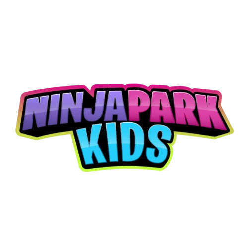

# 🥷 Ninja Park Kids - Sistema de Registro y Gestión

<p align="center">
  
</p>

El **Sistema de Registro y Gestión para Ninja Park Kids** es una plataforma web moderna y robusta construida con **Laravel**, diseñada para digitalizar, optimizar y automatizar los procesos operativos de parques de entretenimiento infantil.

Permite a los representantes registrar a los participantes, firmar digitalmente deslindes de responsabilidad (Waivers), generar pases con códigos QR únicos y gestionar de manera integral la operativa del parque (tarifas, horarios, promociones, reportes y más).

---

## 🚀 Características Principales

### 📋 Módulo de Registro y Legal (Waiver Digital)
*   **Firma Digital Integrada:** Firma de acuerdos de responsabilidad en tiempo real utilizando `Signature Pad`.
*   **Generación de PDF:** Creación automática y descarga del deslinde firmado con validez jurídica.
*   **Validación de Datos:** Registro completo de Representantes (padres/tutores) y múltiples Participantes (niños).

### 🎫 Gestión de Acceso y Pases
*   **Pases con Códigos QR:** Emisión de pases únicos con códigos QR dinámicos para los participantes.
*   **Escaner QR para Staff:** Interfaz integrada para operadores usando la cámara del dispositivo móvil o PC (`HTML5-QRCode`) para validar accesos en segundos.

### ⚙️ Panel de Administración y Configuración
*   **Dashboard Estadístico:** Gráficas interactivas del flujo de visitantes e ingresos utilizando `Chart.js`.
*   **Gestión Operativa:** Configuración dinámica de tarifas, horarios especiales del parque y promociones de temporada.
*   **Control de Roles:** Seguridad avanzada mediante middleware (`CheckRole`) con niveles de acceso: Administrador, Operador/Staff y Representante.

### 🤖 Canales Automatizados
*   **Integración de Chatbot:** Controlador API para la comunicación automatizada de consultas frecuentes e integraciones.

---

## 🛠️ Stack Tecnológico

El proyecto está diseñado bajo una arquitectura limpia y de alto rendimiento utilizando:

*   **Backend:** PHP 8.2+ & [Laravel 11](https://laravel.com/)
*   **Frontend Interactivo:** [Alpine.js](https://alpinejs.dev/) & [Bootstrap 5](https://getbootstrap.com/)
*   **Estilos y Componentes:** CSS Moderno e Interfaz Responsiva
*   **Generación de Documentos:** `DomPDF` para deslindes en PDF
*   **Librerías Clave:**
    *   `SignaturePad.js` (Captura de firmas)
    *   `HTML5-QRCode` (Lectura y escaneo de códigos QR)
    *   `Chart.js` (Reportes visuales)
    *   `SweetAlert2` & `Flatpickr` (Experiencia de usuario premium)

---

## 📂 Estructura del Proyecto (Puntos Clave)

```bash
├── app/
│   ├── Http/Controllers/
│   │   ├── Admin/          # Controladores de administración (Usuarios, Config, Reportes)
│   │   ├── Staff/          # Panel de operadores de taquilla/acceso
│   │   └── Api/            # APIs de integración y Chatbot
│   └── Models/             # Modelos de base de datos (AcuerdoFirmado, Participante, Representante, etc.)
├── database/
│   ├── migrations/         # Esquema de base de datos relacional
│   └── seeders/            # Datos iniciales (Roles, Términos y Condiciones, Administrador)
├── resources/
│   ├── views/
│   │   ├── admin/          # Vistas Blade del panel administrativo
│   │   ├── registro/       # Flujo de registro de participantes, firma y pase
│   │   └── pdf/            # Plantilla del documento legal del acuerdo
│   └── css/ & js/          # Archivos de recursos y dependencias frontend
└── public/                 # Archivos estáticos, fuentes tipográficas personalizadas y scripts compilados
```

---

## 📦 Instalación y Configuración Local

Sigue estos pasos para levantar el entorno de desarrollo en tu máquina local:

### 1. Clonar el repositorio
```bash
git clone https://github.com/LinaresJose/Ninja-Park-Kids.git
cd Ninja-Park-Kids
```

### 2. Instalar dependencias de PHP y Node.js
```bash
composer install
npm install
```

### 3. Configurar las variables de entorno
Copia el archivo de ejemplo a un archivo `.env` real:
```bash
cp .env.example .env
```
Abre `.env` y configura tus credenciales de base de datos (por ejemplo, en Laragon):
```env
DB_CONNECTION=mysql
DB_HOST=127.0.0.1
DB_PORT=3306
DB_DATABASE=ninja_park_kids
DB_USERNAME=root
DB_PASSWORD=
```

### 4. Generar la clave de aplicación y enlazar almacenamiento
```bash
php artisan key:generate
php artisan storage:link
```

### 5. Correr las migraciones y sembrar datos de prueba
Esto creará las tablas y sembrará los roles, términos y el usuario administrador por defecto.
```bash
php artisan migrate --seed
```

### 6. Iniciar los servidores de desarrollo
Para levantar el servidor de Laravel:
```bash
php artisan serve
```
Y para la compilación de recursos frontend con Vite:
```bash
npm run dev
```

---

## 🔒 Seguridad y Licencia
El proyecto cuenta con estrictos controles de sesión y políticas de deslinde de responsabilidad digital de acuerdo con los términos legales vigentes del parque. 

Distribuido bajo la Licencia **MIT**. Consulta el archivo `LICENSE` para más información.
